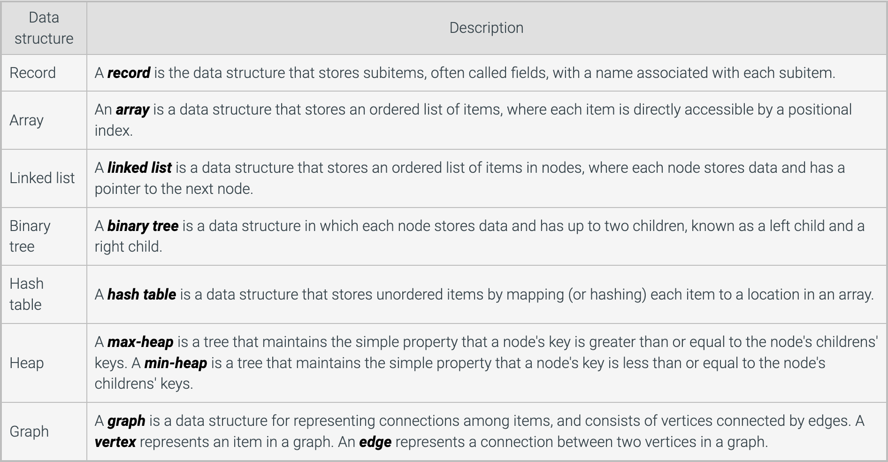
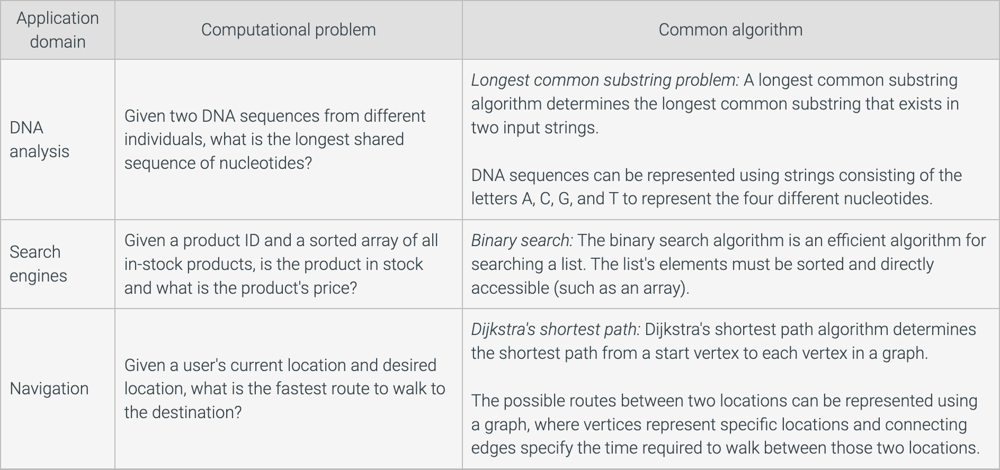

# UOP_COMP53

# 1. Introduction to Data Structures and Algorithm
## 1.1 Data Structure
A data structure is a way of organizing, stroring, and performing operations on data. Operations performed on a data structure include accessing or updating stored data, searching for specific data, inserting new data, and removing data.
 

- A linked list stores an ordered list of items. The links in each node define the order in which items are stored.
- A binary tree node can have no children, a single left or right child, or both a left and right child.
- The data stored in a list node can be a record with multiple subitems. Ex: A linked list storing employee data might use a record containing the employee's name, title, and salary. Also, the list node itself can be implemented as a record, having subitems for the data and the pointer to the next node.
- Array elements are stored in sequential locations, so can be easily accessed using an index.

### Choosing data structures
The selection of data structures used in a program depends on both the type of data being stored and the operations the program may need to perform on that data. Choosing the best data structure often requires determining which data structure provides a good balance given expected uses.

For example, a program requires insertion of a new data, a linked list may be a better choice than an array
Inserting an item at a specific location in an array requires making room for the item by shifting higher-indexed items. Once the higher index items have been shifted, the new item can be inserted at the desired index.
To insert new item in a linked list, a list node for the new item is first created. Item B's next pointer is assigned to point to item C. Item A's next pointer is updated to point to item B. No shifting of other items was required.

## 1.2 Introduction to algorithim
### Algorithm
An algorithm describes a sequence of steps to solve a computational problem or perform a calculation. An algorithm can be described in English, pseudocode, a programming language, hardware, etc. A computational problem specifies an input, a question about the input that can be answered using a computer, and the desired output.

### Practical applications of algorithms
Computational problems can be found in numerous domains, including e-commerce, internet technologies, biology, manufacturing, transportation, etc. Algorithms have been developed for numerous computational problems within these domains.


### Efficient algorithms and hard problems
Computer scientists and programmers typically focus on using and designing efficient algorithms to solve problems. Algorithm efficiency is most commonly measured by the algorithm runtime, and an efficient algorithm is one whose runtime increases no more than polynomially with respect to the input size. However, some problems exist for which an efficient algorithm is unknown.

NP-complete problems are a set of problems for which no known efficient algorithm exists. NP-complete problems have the following characteristics:

No efficient algorithm has been found to solve an NP-complete problem.
No one has proven that an efficient algorithm to solve an NP-complete problem is impossible.
If an efficient algorithm exists for one NP-complete problem, then all NP-complete problems can be solved efficiently.
By knowing a problem is NP-complete, instead of trying to find an efficient algorithm to solve the problem, a programmer can focus on finding an algorithm to efficiently find a good, but non-optimal, solution.

## 1.3 Relation between data structures and algorithms
### Algorithms for data structures
Data structures not only define how data is organized and stored, but also the operations performed on the data structure. While common operations include inserting, removing, and searching for data, the algorithms to implement those operations are typically specific to each data structure. Ex: Appending an item to a linked list requires a different algorithm than appending an item to an array.

```Cpp
// Algorithm for appending to array
ArrayAppend(array, newItem) {
   currentSize = array⇢length
   Increase array size by one
   array[currentSize] = newItem
}
```
```Cpp
// Algorithm for appending to linked-list
ListAppend(list, newNode) {
   if (list⇢head == null) { // List empty
      list⇢head = newNode
      list⇢tail = newNode
   }
   else{
      list⇢tail⇢next = newNode
      list⇢tail = newNode
   }
   list⇢length++
}
```
The algorithm to append an item to an array determines the current size, increases the array size by 1, and assigns the new item as the last array element.
The algorithm to append an item to a linked list points the tail node's next pointer and the list's tail pointer to the new node.

### Algorithms using data structures
Some algorithms utilize data structures to store and organize data during the algorithm execution. Ex: An algorithm that determines a list of the top five salespersons, may use an array to store salespersons sorted by their total sales.

```Cpp
DisplayTopFiveSalespersons(allSalespersons) {
   // topSales array has 5 elements
   // Array elements have subitems for name and total sales
   // Array will be sorted from highest total sales to lowest total sales
   topSales = Create array with 5 elements 
   
   // Initialize all array elements with a negative sales total
   for (i = 0; i < topSales⇢length; ++i) {
      topSales[i]⇢name = ""
      topSales[i]⇢salesTotal = -1
   }

   for each salesPerson in allSalespersons {
      // If salesPerson's total sales is greater than the last
      // topSales element, salesPerson is one of the top five so far
      if (salesPerson⇢salesTotal > topSales[topSales⇢length - 1]⇢salesTotal) {

         // Assign the last element in topSales with the current salesperson
         topSales[topSales⇢length - 1]⇢name =  salesPerson⇢name 
         topSales[topSales⇢length - 1]⇢salesTotal =  salesPerson⇢salesTotal 

         // Sort topSales in descending order
         SortDescending(topSales)
      }
   }

   // Display the top five salespersons
   for (i = 0; i < topSales⇢length; ++i) {
      Display topSales[i] 
   }
}
```
